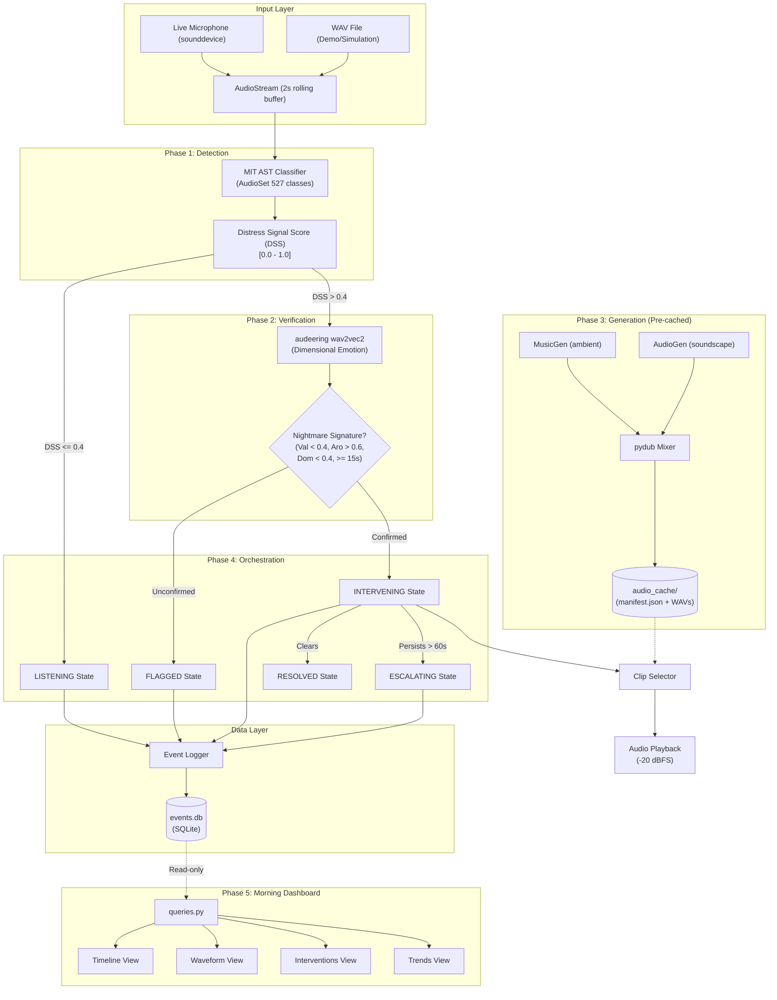

# SentinelSleep Architecture

This document describes the 4-layer pipeline architecture for the SentinelSleep audio AI system.

## Data Flow Constraints

1. **Memory Budget**: Only the L1 (AST) and L2 (wav2vec2) models are loaded in the live inference loop. The L3 models (MusicGen, AudioGen) are too large for the 8GB M2 budget and run strictly offline via `scripts/pregenerate_cache.py`.
2. **State Changes**: The State Machine is pure. State transitions are computed from observations and then immediately committed to SQLite by the `EventLogger` *before* any audio side effects occur.
3. **Dashboard Access**: The Streamlit dashboard (`Phase 5`) is completely decoupled from the live orchestrator and enforces a strict read-only constraint against `events.db`.
